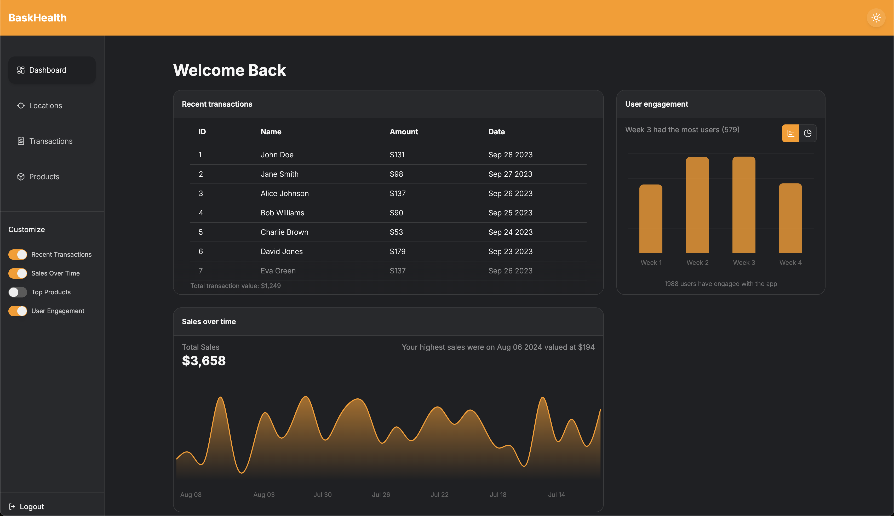
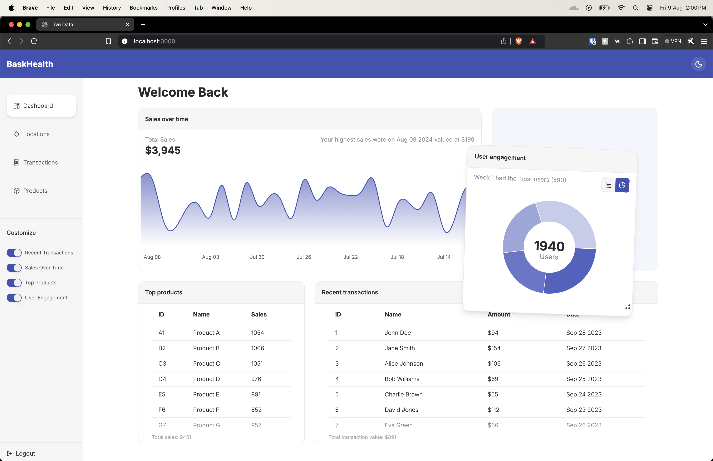
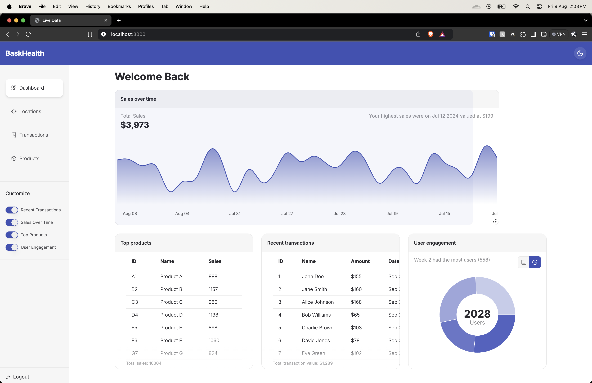
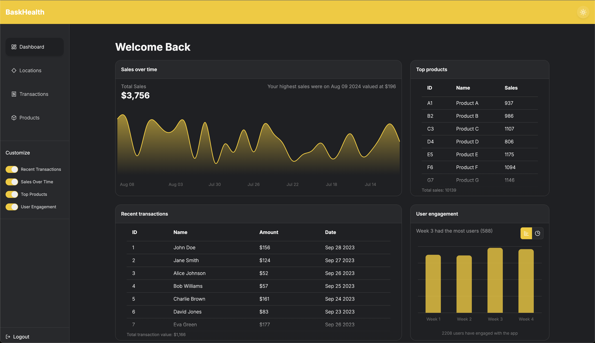
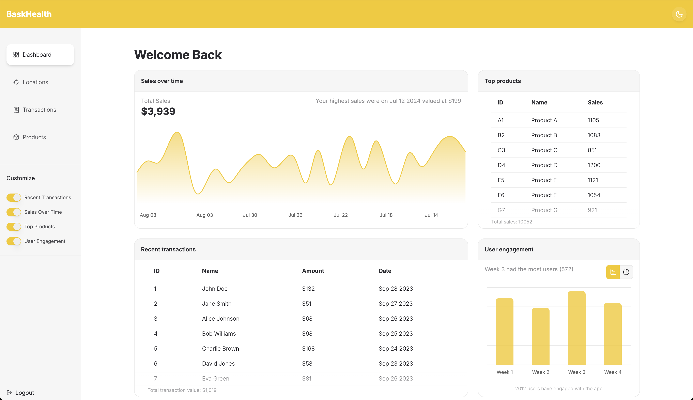
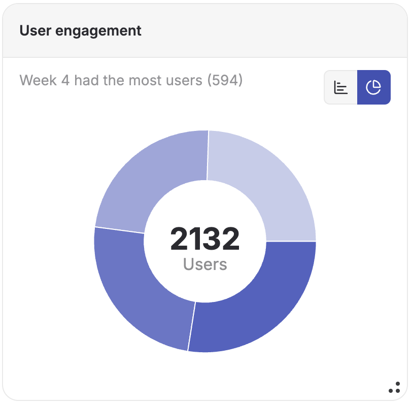
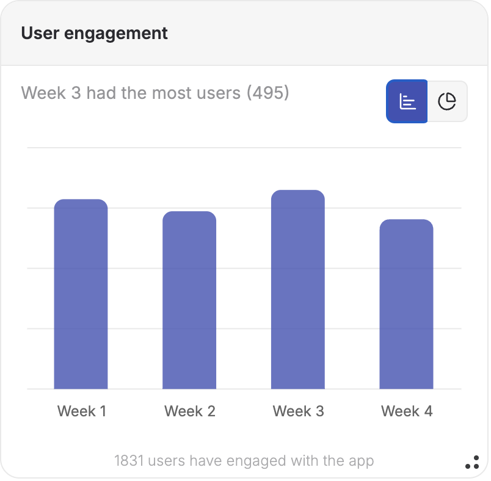
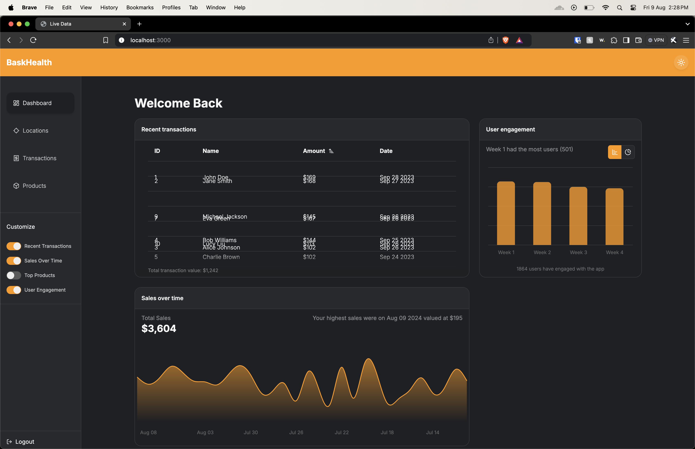
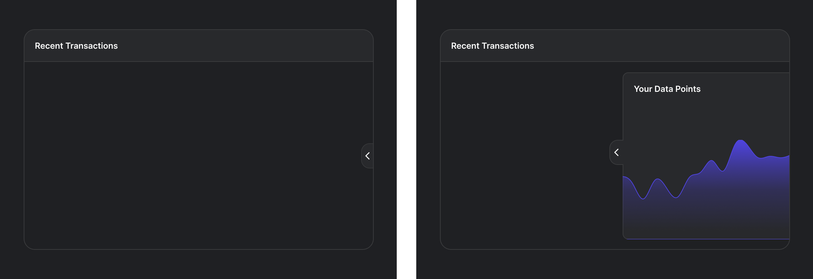

# BaskHealth Live Data Dashboard

BaskHealth Live Data Dashboard is a web application developed for the BaskHealth hiring challenge. This features a highly customizable dashboard that fetches data from the provided API every 5 seconds and displays it in a visually appealing manner. It also includes a random styles generator that uses custom material design color palette to generate a random color scheme for the dashboard.

## Table of Contents
- [Live Demo and Video Walkthrough](#live-demo-and-video-walkthrough)
- [Dashboard customization an interactivity](#dashboard-customization-an-interactivity)
- [Design and Architectural Decisions](#design-and-architectural-decisions)
  - [Directory Structure](#directory-structure)
  - [Random styles generator](#random-styles-generator)
  - [UX and UI decisions](#ux-and-ui-decisions)
  - [Layout and routing](#layout-and-routing)
  - [Error handling](#error-handling)
  - [Data memoization](#data-memoization)
  - [Saved User Preferences](#saved-user-preferences)
- [Setup Instructions](#setup-instructions)

## Live Demo and Video Walkthrough
Checkout the live demo by visiting [Live Demo](https://sudeep-bask-health.vercel.app/)

[Watch the video](https://www.youtube.com/watch?v=f_f3OJvQU0Y)

> I have made a minor change after the video was made. I am now fetching the data on both server and client side. Server side api response is sent to the dashboard component and it's used as initial data for the react query hook.

## Dashboard customization an interactivity
The dashboard implemented is highly customizable. 
- The user has a choice to toggle the visibility of the widgets with toggles provided on the sidebar. 



- The user can drag around by  the widgets using the widget header on desktops and a drag handle that shows up at right side of the header as per their preference based on what data points they deem as important.




- The user can resize with the help of resize handle at the bottom right of every widget. 



- The user has an option to pick between dark and light mode.




- The user can switch between the chart types for User Engagement widget by clicking on the chart type selector.




- The user can sort the tabular data by clicking on the column headers. The data rows smoothly animate and rearrange themselves within the table The live data coming in results in a smoothly animated rearrangement of table rows. If sort is turned on, the rows rearrange to reflect the live data every ping.



## Design and Architectural Decisions 
The dashboard is built using Next.js 14, leveraging the new app directory feature. To enhance the initial load time, the dashboard component is lazy-loaded. This component is wrapped in a Suspense component to display a loading state while data is being fetched. I opted for client-side rendering for the dashboard since it requires real-time data fetching. Streaming HTML for the widgets wouldn’t be ideal due to their dynamic nature. Although a server side request has been added to Home page and the data is passed on to the client side and used as initial data for the react query hook.

> If there are any magic numbers used in the codebase, they have been appropriately explained with the comment right above them.

### Choice of important libraries
- <b>typescript</b> for type safety

  The project features extensive use of typescript for a type-safe codebase. I've created custom types(with some generics). Type definitions can be found in the `src/types` directory.

- <b>@tanstack/react-query</b> for data fetching

  It's a lightweight and flexible data fetching library that provides a simple and intuitive API for fetching data. It also does refetch on window focus provided the data is marked stale that can be controlled with cache time. I've used refetch time to refetch the data from the API every 5 seconds. If an api call fails (5% chance of failure is hit), it automatically retries the request therefore providing a great error handling experience.

- <b>react-grid-layout</b> for layout management

  It's a powerful and flexible layout management library that allows users to create complex and responsive layouts with ease. I have set up two breakpoints but can add more if needed.

- <b>zustand</b> for state management

  It's a simple and powerful state management library that provides a simple and intuitive API for managing state. I've used it to manage the layout state and the widget visibility state.

- <b>tailwindcss</b> for styling

  It's a utility-first CSS framework that provides a set of utility classes for styling common UI components. The common complaint with tailwind is that it leads to absurdly long and affects DX. TO counter this I've used `|` to separate out the class names based on what aspect of a component they are targeting. I've also combined it with tailwind-merge to avoid conflicts.

- <b>framer-motion</b> for animations

  It's a powerful and flexible animation library that provides easy to use components for creating animations. I've used it to animate the table rows rearranging on sort.

- <b>recharts</b> for charts

  It's a powerful and flexible charting library that provides a wide range of chart types and customization options. I've customized the charts to make them more visually appealing and easier to read.

- <b>@tanstack/react-table</b> for table

  It's a headless table library that provides a great level of customization and I prefer having control over the styles. I've used it to create a Table component with sorting functionality.

- <b>dayjs</b> for date formatting

  It's a super lightweight and flexible date formatting library. 

- <b>radix primitives</b> for custom components

  It's a set of primitives that provide a set of low-level building blocks for building custom components. I've picked for the accessibility layer it provides with the primitives and like I stated earlier, I like to have control over the styles.

- <b>lucide-react</b> for icons
  It's a set of icons that are designed to be accessible.


### Directory Structure
The directory structure is thoughtfully organized to facilitate easy navigation and maintain a well-structured codebase, contributing to a smooth developer experience and minimizing confusion. The code structure adheres to atomic design  for better component organization and reusability.

- `src/app` - layout, pages and api routes
- `src/components/` - Contains all the components used in the project. The components are further subdivided into different categories based on [atomic design methodology](https://atomicdesign.bradfrost.com/chapter-2/).
- `src/constants` - Contains all the constants used in the project. Like widgets, their default configurations and localStorage keys 
- `src/hooks` - Contains all the custom hooks used in the project.
- `src/queries` - This project uses `@tanstack/react-query` for data fetching. This directory contains the api queries used in the project.
- `src/stores` - This project uses `zustand` for state management. This directory contains the state stores used in the project.
- `src/types` This directory contains the user defined types. Throught the project, the types that have been exported are prefixed with `T`.
- `src/utils` - This directory contains the utility functions used in the project.
- `src/wrappers` - This directory contains provider wrappers for the project. Currently, it only has the `QueryClientProvider` wrapper.

### Random styles generator
The project features a random styles generator. These styles are generated by the api with route(/api/base-style-sheet.css) which uses the generator function can be found in the `src/utils/generate-material-palette.ts` file. The function generates a palette of colors provided a base color which is picked at random. The api responds with `text/css` content type which lets the browser interpret the text as css. This route is linked as a stylesheet in layout.tsx file.

### UX and UI decisions
- For generating random styles, I've picked the material palette generator to ensure that primary colors have a good contrast ratio.

- Care is taken to provide user feedback to any action they decide to take. 
  - Appropriate cursors are used to indicate the action that can be performed.(Drag handle & resize handle)
  - When a particular column is sorted, an icon indicates the sorting direction.

- On mobile devices, scrolling posed as a challenge since the widgets can be dragged around because of which a smaller area is shown as drag handle indicated by an icon at the right side of the widget header.

- The tables have a faded gradient at the bottom to indicate that the table is scrolled to the bottom on devices that do not show a scrollbar.

- Each widget has a helper text that provides important additional information about the widget.

- The widgets while being dragged have a slight tilt and a pop effect to indicate that they are items in focus.

### Layout and routing
The project features a layout that serves as a container for the dashboard and the widgets. The layout is divided into two sections: the sidebar and the main section. This ensures that if there are anymore routes added, the layout remains consistent and rest of the pages are loaded via html streaming.

### Error handling
As stated before since the project uses `@tanstack/react-query` for data fetching, the api errors are handled gracefully by reattempting the request on failure. In case all the reattempts fail(5 retries by default), I've added a toast notification to notify the user that something went wrong with the request.

### Data memoization
Wherever there's calculations needed to be run on the api data, I've used `useMemo` to memoize the data. This ensures that the calculations are only run once and the result is cached for future use.

### Saved User Preferences
The project features a localStorage to store the user preferences. I've written a custom hook to write data to localStorage. This hook debounces user actions for 500ms to avoid unnecessary writes to localStorage. Since the state is stored in localStorage, the user is greeted with their preferred setting on refresh/next visit.

## Setup Instructions

> This project has been setup using pnpm as the package manager, to avoid lock file being ignored please use pnpm.

If you haven't already, install pnpm by running the following command:

```bash
npm install -g pnpm
```

Then, clone the repository and install the dependencies:

```bash
git clone https://github.com/BaskHealth/live-data-dashboard.git
cd live-data-dashboard
pnpm install
```

### Environment variables required 
Create a .env file in the root directory of the project and the variable values featured in `.env.example` file provided in the root directory.

### Development mode
```bash
pnpm run dev
```

### Production mode
- Build the project
  ```bash
  pnpm run build
  ```
- Serve the built project
  ```bash
  pnpm run start
  ```

## Possible Improvements
- Add test cases with at least 90% coverage
- Add a web vitals reporter to measure the performance of the application
- Since the styles are generated via an api, there can be a UI to let user choose the primary color that generates the palette.
- I was hoping to add charts to the tablular data as well but couldn't finish it in time.
